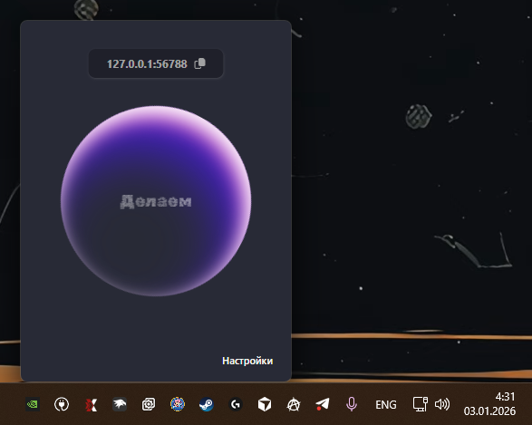
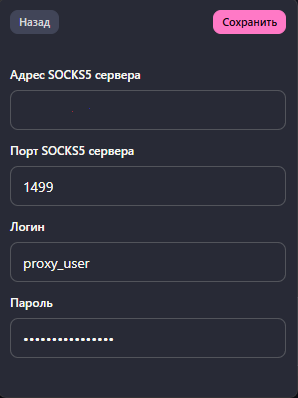

# Че за хуйня?

Это просто ебучий прокси сервер для прокси сервера, чтобы поднять локальный socks5 сервер, который ходит на удаленный socks5 сервер.

# А нахуя, ты что ебанутый?

Ну тут нужно по порядку

### Ебаный Хромиум

Ебаный Google Chrome, и все ебаные браузеры на том же пидорском движке имеют одну проблему: нихуя не умеют в socks5 прокси сервера с авторизацией

Все ахуенно работает, пока у тебя анонимная авторизация, но я же не умалишенный держать удаленный socks5 сервер без пароля (к слову в ебаном firefox такой проблемы нет, но есть другая - firefox залупа, которой невозможно пользоваться)

### Ебаный сплит тунелинг в Amnezia

Оно умеет красиво разделять трафик только по заранее описанным ipv4 адресам, нельзя просто скопрмить какой-то домен и сказать - ты через VPN, потому, что большая часть ебучий ресурсов в интернете за CDN сетками, типа клаудфлейра, из-за чего это раздельное тунелирование до конца нихуя не работает нормально.

Я иду на сайт, который мне деет эти ебаные geo-ip списки, выбираю "YOUTUBE", он дает мне все подсетки гугла, но почему-то после этого у меня половина интернета хуярит через VPN, тот же faceit перестает давать выбирать MSK сервера для игры, пиздец.

А еще есть же этот, рабочий VPN, нельзя просто врубить VPN на все (без сплит тунелирования), тогда начнут конфликтовать рабочий и "свой"

### А че в итоге то

Ну так вот, а socks5 в браузере позвоялет роутить это все на базе доменов, да и чаще всего VPN нужен именно в браузере, остальное - похуй

Если ты знаешь какой-то ахуенный вариант настройки, какой-то клиент VPN и всей этой хуйни, который нормально роутит на базе доменов - расскажи, если не жалко конечно, например через issues.

В хроме юзаю этот плагин для менеджмента прокси, удобные профили и вайт / блек листы https://helebest.github.io/x-proxy/
